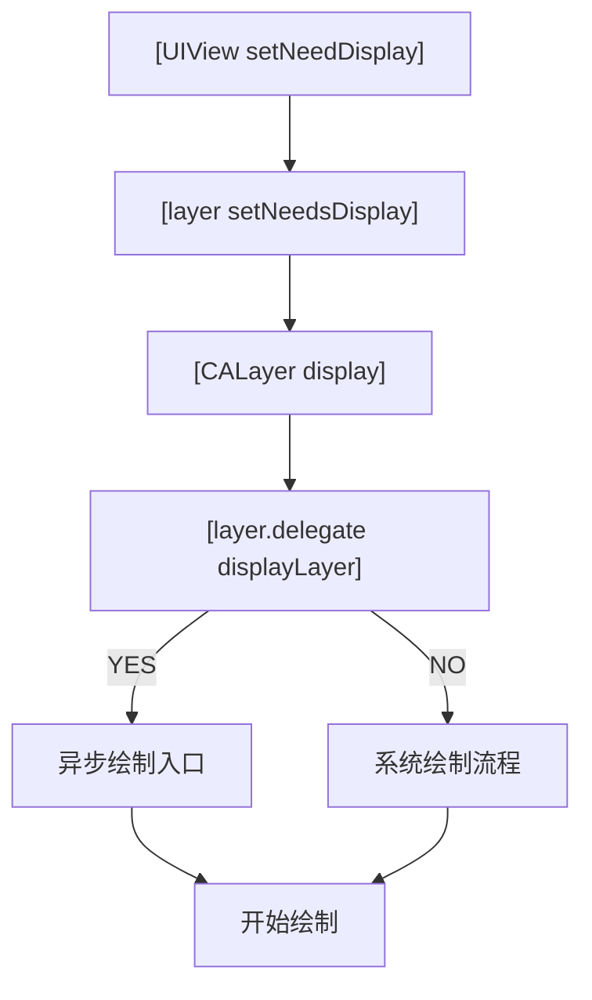
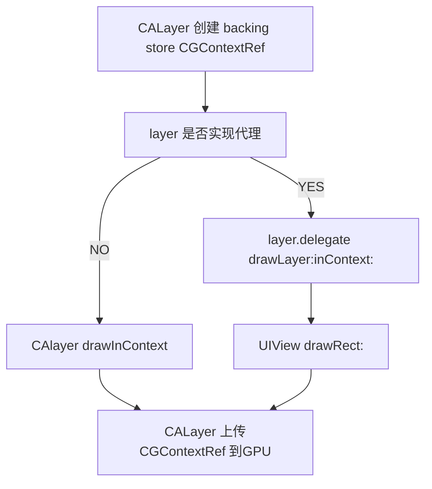
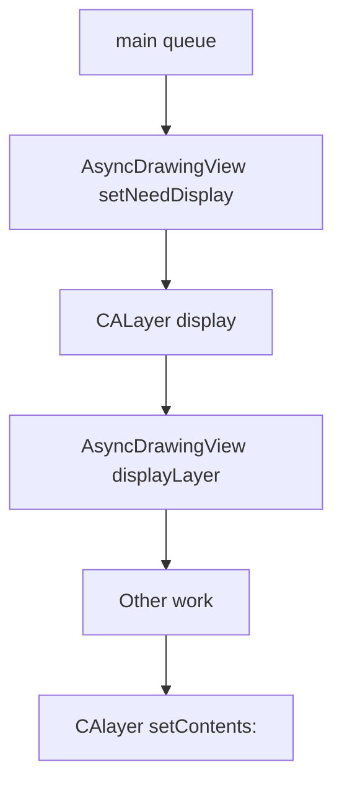
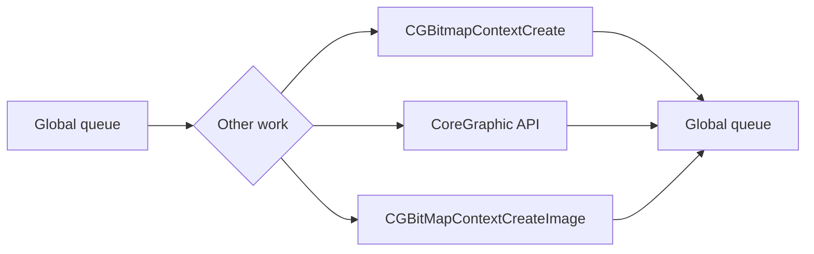

# UI 视图


## 屏幕的显示原理

CRT 的电子枪按照屏幕最上方，从左到右，一行行的进行扫描。
显示器会用硬件时钟产生的一系列信号，把显示器的显示过程和系统的显示控制器同步。
CRT换到下一行的时候，准备扫描的时候，显示器会发出一个水平同步信号horizonal synchronization），简称 HSync。

当一帧全部扫描完成后，CRT回复到初始状态时候，会发出一个垂直同步信号（vertical synchronization）简称VSync, 显示器通常会一VSync的频率进行刷新


通常来说CPU 和GPU 是一上面的方式协同工作。
* CPU 计算好显示内容，提交给GPU
* GPU 渲染完成后将结果放入缓存区
* 视频控制器会按照VSync的信号逐行读取帧缓冲区的数据，经过可能的数据模型转换
* 显示到屏幕上

<!--more-->
## 卡顿产生的原因


* VSync信号到来之后，系统图形服务会通过CADisplayLink 等机制通过APP
* APP 主线程开始通过CPU计算显示内容，比如视频的创建，布局计算，图片解码等。
* CPU 计算好的的结果提交给GPU。
* GPU 进行变换、合成、渲染。
* GPU 提交到帧缓存区
* VSync 再次到来后显示

> 如果两个VSync 的时间段内CPU和GPU没有全部处理完成提交。当前这一帧会被忽略，继续等待下一帧，这次屏幕显示会保留上次的显示不变。这就是界面卡顿的原因。
> 
>CPU 和 GPU 不论哪个阻碍了显示流程，都会造成掉帧现象。所以开发时，也需要分别对 CPU 和 GPU 压力进行评估和优化。

### CPU 资源消耗原因和优化


对象创建会分配内存，调整属性，还有文件的读写操作等操作，比较消化CPU资源。

**对象创建**
1. 尽量使用轻量级别的对象，比如CALayer比UIVIew 轻量，不需要点击事件，用CAlayer 比较合适
2. 尽量推迟对象创建时间。并把对象创业分配到多个任务中（比如懒加载）
3. 对象最好可以服用，服用的代价比创建，释放对象消耗小。对象尽量放在一个缓冲池中服用。

**对象调整**

对象调经常消耗CPU资源，CALayer内部没有属性，在调用相关属性时,是生成一个临时方法,调用结束后再把值存到 CALayer的一个字典中,所以在调整 UIView的相关属性时, UIView和 CALayer 之间会产生一系列的通知和代理.所以在优化性能时,应该尽量避免调整视图层次 添加和移除视图.

**对象销毁**

对象的销毁相对消耗的资源较少,通常当容器类持有大量对象时,其造成的消耗也是非常明显的,所以应当将消耗过程放到后台线程执行.

**布局计算**

1. 布局计算也是常见的CPU 消耗.在页面内布局非常复杂时,最好能提前在后台计算好布局
2. 图片的size最好刚好跟UIImageView的size保持一致

**文本渲染**

大量文本显示的时候，用TextKit或CoreText 对文本异步绘制，能直接过去文本宽高信息，也能减少多次绘制。CoreText 对象占用内存较少，可以缓存下来以备稍后多次渲染。

**控制一下线程的最大并发数量**

**尽量把耗时的操作放到子线程**

**图片的解码**

UIImage 或者 CGImageSource 的那几个方法去创建图片的时候，图片数据并不会立刻解码。图片设置到 UIImageView 或者 CALayer.contents 中去，并且 CALayer 被提交到 CPU 前，CGImage 中的数据才会得到解码，这一步是发生在主线程的，并且不可避免。如果想绕开这个机制，常见的做法就是在后台线程先把图片绘制到 CGBitmapContent 中，然后从 Bitmap 直接创建图片。

**图片的绘制**

图片的绘制通常是指那些以 CG 开头的方法把图像放到画布中，常见的地方是 [UIView drawRect:] 。由于 CoreGraphic 方法通常都是线程安全的，所以图像的绘制可以很容易的放到后台线程去执行，一个简单的异步绘制的过程大概如下
```
- (void) display {
        dispatch_async(backgroundQueue, ^{
        CGContextRef ctx = CGBitmapContextCreate(...);
        // draw in context...
        CGImageRef img = CGBitmapContextCreateImage(ctx);
        CFRelease(ctx);
        dispatch_async(mainQueue, ^{
        layer.contents = img;
        });
    });
 }
```

#### GPU 资源消耗原因和优化

> GPU :接收提交的纹理（Texture）和顶点描述（三角形），应用变换（transform）、混合并渲染，然后输出到屏幕上。所有的 bitmap 包括图片、文本最终都要由内存提交到显存,绑定为 GPU Texture .无论是提交到显存的过程,还是GPU调整和渲染 Texture的过程,都要消耗不少的 GPU 资源.

**纹理的渲染**

* 所有的bitmap，view ，栅格化都要提交GPU，绑定GPU Texture，提交过程还是绑定过程都要消耗GPU资源。当在短时间内处理大量图片时候，CPU 占用率低，GPU占用率高。所以尽可能的多张照片合成一张照片。
* 处理大图片，CPU，GPU 消耗都非常大，ios 纹理尺寸上限都是4096×4096。尽量不要让图片和视频超过这个值

**视图的混合**
多个视图重叠后，GPU首先会把他们混合在一起。视图结果如果过于复杂。混合过程也会消耗很多GPU资源。

* 尽量减少视图数量和层次
* 不透明的视图里标明 opaque 属性以避免无用的 Alpha 通道合成
* 也可以把多个视图预先渲染为一张图片来显示

**图形的生成**

* 离屏渲染： 处理图层的属性在被指定为未被预和成之前不能直接在屏幕上显示，GPU在当前屏幕以为缓冲区意外新开辟一个缓冲区进行的渲染操作。

* 离屏渲染的触发 ： CALayer 的 border、圆角、阴影、遮罩（mask），CASharpLayer 的矢量图形显示，通常会触发离屏渲染（offscreen rendering）

* 离屏渲染避免
    1.  可以尝试开启 CALayer.shouldRasterize 属性，但这会把原本离屏渲染的操作转嫁到 CPU 上去
    2.   用一张已经绘制好的圆角图片覆盖到原本视图上面来模拟相同的视觉效果
    3.   就是把需要显示的图形在后台线程绘制为图片，避免使用圆角、阴影、遮罩等属性

## UIView 绘制原理

UIView 在调用setNeedsDisplay，系统调用view 对应layer 的setNeedsDisplay，对layer进行标记。VSync（runloop）消息到来的时候，调用 CAlayer 的dispaly 方法，进入真正的绘制流程中。

> App 的 主线程Runloop 在启动后会注册对应的 CFRunLoopSource 通过 mach_port 接收传过来的时钟信号通知，随后 Source 的回调会驱动整个 App 的动画与显示。

CALayer的display方法的内部实现,首先会判断layer的delegete是否响应display方法,如果代理不响应就会进入到系统的绘制流程当中,如果响应,实际上就为我们提供了异步绘制的接口,这样就构成了UIView的绘制原理




##### 异步绘制入口
* CPU会为layer分配一块内存用来绘制bitmap，叫做backing store
* 创建指向这块bitmap缓冲区的指针，叫做CGContextRef
* 通过Quartz2D，绘制bitmap
* 如果layer实现deleget（也就是 View 的drawRect）.可以通过drawRect方法做一些其他的绘制工作
* 都有calayer上传backing store



##### 异步绘制
如果遵从或者实现了displayLayer方法,我们就可以进入到异步绘制流程当中,在异步绘制的过程当中

* 就由delegete去负责生成bitmap位图
* 设置改bitmap作为layer.content属性的值



