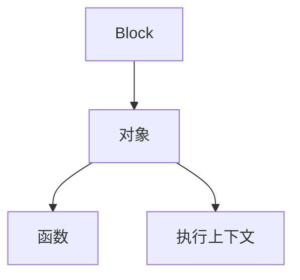

# ios block 分析


## block 介绍

> `Block`是将**函数**及其**执行上下文**封装起来的对象

```
int val = 10;
void (^block)(void) = ^{
      printf("val=%d\n",val);
};
val = 2;
block();
```

装换后
```
int val = 10;
void (*block)(void) = ((void (*)())&__main_block_impl_0((void *)__main_block_func_0, &__main_block_desc_0_DATA, val));
val = 2;
((void (*)(__block_impl *))((__block_impl *)block)->FuncPtr)((__block_impl *)block);

```
`__main_block_impl_0` 
第一个参数应该是无类型的函数指针
第二个代表`block` 相关描述的结构体
第三个，使用的变量

取地址`__main_block_impl_0` 通过强制类型装换 `(void (*)()`

<!--more-->
```
struct __main_block_impl_0 {
  struct __block_impl impl;
  struct __main_block_desc_0* Desc;
  int val;
  __main_block_impl_0(void *fp, struct __main_block_desc_0 *desc, int _val, int flags=0) : val(_val) {
    impl.isa = &_NSConcreteStackBlock;
    impl.Flags = flags;
    impl.FuncPtr = fp;
    Desc = desc;
  }
};
```

```
struct __block_impl {
  void *isa;//isa指针，block 是面向对象的标准
  int Flags;
  int Reserved;
  void *FuncPtr;//函数指针
};
```
```
static void __main_block_func_0(struct __main_block_impl_0 *__cself) {
int val = __cself->val; // bound by copy
    printf("val=%d\n",val);
}
```


block 调用

```
((void (*)(__block_impl *))((__block_impl *)block)->FuncPtr)((__block_impl *)block);
```

block 强制 `__block_impl` 来获取函数指针
参数 是block和相应截获的变量

## 截获变量

- **基本数据**类型的局部变量截获**值**
- 对于**对象**类型的局部变量连同**所有权、修饰符**一起截获
- **局部静态变量**以**指针**形式截获
- **全局变量、静态变量 ** **不截获**


```
// 全局变量
int global_var = 4;
// 静态全局变量
static int static_global_var = 5;

- (void)method
{ 
    // 基本数据类型的局部变量
    int var = 1;
    // 对象类型的局部变量
    __unsafe__unretained id unsafe_obj = nil;
    __strong id strong_obj = nil;
    
    //局部静态变量
    static int static_var = 3;
    void(^Block)(void) = ^int(int num)
    {
        NSLog(@"局部变量<基本数据类型> var %d",var);
        NSLog(@"局部变量<__unsafe__unretained 对象类型> %@",unsafe_obj );
        NSLog(@"局部变量<__strong 对象类型> %@",strong_obj );
        NSLog(@"静态变量 %d" , global_var);
        NSLog(@"静态全局变量 %d" , static_global_var);

    };
    Block();
}
```

```
struct __MCBlock__method_block_impl_0 {
  struct __block_impl impl;
  struct __MCBlock__method_block_desc_0* Desc;
    // 截获局部变量的值
  int var;
    // 连同所有权修饰符一起截获
  __unsafe_unretained id unsafe_obj;
  __strong id strong_obj;
    // 以指针形式截获局部变量
  int *static_var;
    // 对全局变量、静态全局变量不截获
    
  __MCBlock__method_block_impl_0(void *fp, struct __MCBlock__method_block_desc_0 *desc, int _var, __unsafe_unretained id _unsafe_obj, __strong id _strong_obj, int *_static_var, int flags=0) : var(_var), unsafe_obj(_unsafe_obj), strong_obj(_strong_obj), static_var(_static_var) {
    impl.isa = &_NSConcreteStackBlock;
    impl.Flags = flags;
    impl.FuncPtr = fp;
    Desc = desc;
  }
};
```

`__MCBlock__method_block_impl_0` 初始化时 
- 对局部基本数据类型只是对其赋值。`var(_var)`
- 对象类型的修饰符和原代码一致
- 静态局部是对指针截获
- 全局变量block 不截获，直接使用

## `__block` 修饰符
`__block` 修饰的变量变成了对象


oc 代码
```
__block int val = 10;
void (^block)(void) = ^{
    printf("val=%d\n",val);
};
val = 2;
block();
```
转换后
```
__attribute__((__blocks__(byref))) __Block_byref_val_0 val = {(void*)0,(__Block_byref_val_0 *)&val, 0, sizeof(__Block_byref_val_0), 10};

void (*block)(void) = ((void (*)())&__main_block_impl_0((void *)__main_block_func_0, &__main_block_desc_0_DATA, (__Block_byref_val_0 *)&val, 570425344));

(val.__forwarding->val) = 2;

((void (*)(__block_impl *))((__block_impl *)block)->FuncPtr)((__block_impl *)block);
```

> 通过 `__block`修饰的对象 变成了 `__Block_byref_val_0` 结构体

`__Block_byref_val_0` 结构体
```
struct __Block_byref_val_0 {
  void *__isa;
__Block_byref_val_0 *__forwarding;
 int __flags;
 int __size;
 int val;
};
```
`__Block_byref_val_0` 有 `isa`指针，所以可以说 `__block`修饰的变量变成了对象

其他对象也是相同
```
    __block NSObject * val = [NSObject new];
```
```
    __attribute__((__blocks__(byref))) __Block_byref_val_0 val = {(void*)0,(__Block_byref_val_0 *)&val, 33554432, sizeof(__Block_byref_val_0), __Block_byref_id_object_copy_131, __Block_byref_id_object_dispose_131, ((NSObject *(*)(id, SEL))(void *)objc_msgSend)((id)objc_getClass("NSObject"), sel_registerName("new"))};

```

```
struct __Block_byref_val_0 {
  void *__isa;
__Block_byref_val_0 *__forwarding;
 int __flags;
 int __size;
 void (*__Block_byref_id_object_copy)(void*, void*);
 void (*__Block_byref_id_object_dispose)(void*);
 NSObject *val;
};
```


栈上的`__forwarding`的指针指向**自身**

## `block` 内存管理


- 全局区 （已初始化数据），`block`没有捕获外部的变量,`retain`、`copy`、`release`操作都无效
- 栈区 `block` MRC 有捕获外部变量`block`在栈区。 `ARC` 用 `__unsafe_unretained` 、`__weak` 修饰取代系统默认的 `__strong` 有捕获变量的block 
- 堆区。`MRC` `block` `copy` 将栈区`block` 拷贝到堆区。`ARC` 默认的修饰符`__strong` 系统会Copy 到堆区。支持 `retain`，`release`

ARC 下block 默认修饰符号 `__strong`

### `block copy` 的操作


栈上 `block` copy 后会在堆上生成相同的`block `


栈上 `block` copy 后 `__forwarding` 指针指向 copy 后的block 区域
所以 copy 前对数据的处理，实际和copy 后的指向是相同的。保证了数据的统一

`__forwarding` 
不论在任何内存位置，都可以顺利访问同一个`__block`对象


## 循环引用
```
- (void)excueBlock{
    _eded = 10;
    self.block = ^(int a){
        printf("%d",_eded);
    };
    self.block (4);
   
}
```

```
static void _I_TestObject_excueBlock(TestObject * self, SEL _cmd) {
    (*(int *)((char *)self + OBJC_IVAR_$_TestObject$_eded)) = 10;
    ((void (*)(id, SEL, void (^ _Nonnull)(int)))(void *)objc_msgSend)((id)self, sel_registerName("setBlock:"), ((void (*)(int))&__TestObject__excueBlock_block_impl_0((void *)__TestObject__excueBlock_block_func_0, &__TestObject__excueBlock_block_desc_0_DATA, self, 570425344)));
    ((void (*(*)(id, SEL))(int))(void *)objc_msgSend)((id)self, sel_registerName("block")) (4);

}
```
```
struct __TestObject__excueBlock_block_impl_0 {
  struct __block_impl impl;
  struct __TestObject__excueBlock_block_desc_0* Desc;
  TestObject *self;
  __TestObject__excueBlock_block_impl_0(void *fp, struct __TestObject__excueBlock_block_desc_0 *desc, TestObject *_self, int flags=0) : self(_self) {
    impl.isa = &_NSConcreteStackBlock;
    impl.Flags = flags;
    impl.FuncPtr = fp;
    Desc = desc;
  }
};
```
实际截获的包含该self，self强用用block，造成自引用的闭环

```
{
    __block TestObject * blockSelf = self;
    _block = ^(int a){
        printf("%d",blockSelf.eded);
    };
    _block(3);
}
```

- MRC 下征程
- ARC 内存泄露，循环引用

ARC


MRC 环境下，`block` 截获外部用 `__block` 修饰的变量，不会增加对象的引用计数
ARC 环境下，`block` 截获外部用 `__block` 修饰的变量，会增加对象的引用计数


改写方法一,采用断环的操作，缺点如果不调用block则一直保持，不会释放
```
{
    __block TestObject * blockSelf = self;
    _block = ^(int a){
        printf("%d",blockSelf.eded);
        blockSelf = nil;
    };
    _block(3);
}
```


