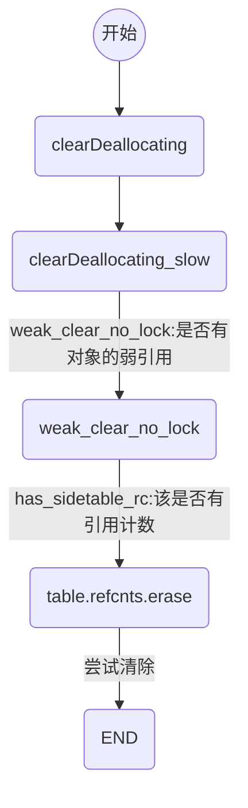

# ios 内存管理
## 概述


## 内存布局


程序的内存布局，最上方是**内核区**内存，最下方是**保留**的内存区域。中间部分用来程序加载。
内存的表示从下到上是由低地址到高地址


- 栈区（stack）：方法调用（定义的方法、函数 上进行工作。向下扩展或向下增长）
- 堆区（heap）：alloc 等分配的对象（创建的对象，block经过copy后有栈上转义到堆。向上增长）
- 未初始化数据（bss）：比如未初始化的全局变量、静态变量
- 已初始化数据（data）：比如已经初始化的全局变量、静态变量
- 代码段（text）：程序所写的代码数据段都在 `.text` 内存中

## 内存管理方案
### TaggedPointer
NSNumber、NSDate一类的变量本身的值需要占用的内存大小常常不需要8个字节，将一个对象的指针拆成两部分，一部分直接保存数据，另一部分作为特殊标记，表示这是一个特别的指针，不指向任何一个地址。所以，引入了Tagged Pointer对象之后isa指针

### NONPOINTER_ISA
**这种是：非指针型isa**
> 64位指针为了内存的利用率。剩余32位 存放了内存管理方面的相关内容

在一个64位的指针内存中，
第0位存储的是indexed标识符，它代表一个指针是否为NONPOINTER型，0代表不是，1代表是。
第1位has_assoc，顾名思义，1代表其指向的实例变量含有关联对象，0则为否。
第2位为has_cxx_dtor，表明该对象是否包含C++相关的内容或者该对象是否使用ARC来管理内存，如果含有C++相关内容或者使用了ARC来管理对象，这一块都表示为YES，
第3-35位shiftcls存储的就是这个指针的地址。
第42位为weakly_referenced，表明该指针对象是否有弱引用的指针指向。
第43位为deallocing，表明该对象是否正在被回收。
第44位为has_sidetable_rc，顾名思义，该指针是否引用了sidetable散列表。
第45-63位extra_rc装的就是这个实例变量的引用计数，当对象被引用时，其引用计数+1，但少量的引用计数是不会直接存放在sideTables表中的，对象的引用计数会先存在NONPOINTER_ISA的指针中的45-63位，当其被存满后，才会相应存入sideTables散列表中。


### 散列表
#### 自旋锁（Spinlock_t）
- Spinlock_t 是**忙等**的锁
- 适用于轻量访问

#### 引用计数表 (RefcountMap)
> 是一个`hash`表


#### 弱引用表 (weak_table_t)


## 引用计数管理
### `retainCount`
```
uintptr_t
objc_object::sidetable_retainCount()
{
    SideTable& table = SideTables()[this]; //(1)
    size_t refcnt_result = 1;
    table.lock();
    RefcountMap::iterator it = table.refcnts.find(this);(2)
    if (it != table.refcnts.end()) {
        refcnt_result += it->second >> SIDE_TABLE_RC_SHIFT;(3)
    }
    table.unlock();
    return refcnt_result;(4)
}
```
- (1)通过`Hash`算法 `SideTables()`中获取`SideTable`
- (2)通过`Hash`算法在引用计数表查找返回iterator
- (3)如果找到  refcnt_result = 引用计数 + refcnt_result，`>> SIDE_TABLE_RC_SHIFT`是因为后两位不是引用计数值，
- (4)返回refcnt_result


### `alloc`
经过一系列调用，调用c 的 `calloc` 函数申请内存
没有设置引用计数

> 但是获取 `retainCount` 会直接返回 refcnt_result 为 1

### `retain`
```
id
objc_object::sidetable_retain()
{
#if SUPPORT_NONPOINTER_ISA
    assert(!isa.nonpointer);
#endif
    SideTable& table = SideTables()[this];
    
    table.lock();
    size_t& refcntStorage = table.refcnts[this];
    if (! (refcntStorage & SIDE_TABLE_RC_PINNED)) {
        refcntStorage += SIDE_TABLE_RC_ONE;
    }
    table.unlock();

    return (id)this;
}
```

> refcntStorage += SIDE_TABLE_RC_ONE; SIDE_TABLE_RC_ONE = (1UL<<2), 是对后面第三位进行 +1 ，后两位不是引用计数

### `release`

```
uintptr_t
objc_object::sidetable_release(bool performDealloc)
{
    SideTable& table = SideTables()[this];
    bool do_dealloc = false;
    table.lock();
    RefcountMap::iterator it = table.refcnts.find(this);
    if (it == table.refcnts.end()) {
        do_dealloc = true;
        table.refcnts[this] = SIDE_TABLE_DEALLOCATING;
    } else if (it->second < SIDE_TABLE_DEALLOCATING) {
        do_dealloc = true;
        it->second |= SIDE_TABLE_DEALLOCATING;
    } else if (! (it->second & SIDE_TABLE_RC_PINNED)) {
        it->second -= SIDE_TABLE_RC_ONE;
    }
    table.unlock();
    if (do_dealloc  &&  performDealloc) {
        ((void(*)(objc_object *, SEL))objc_msgSend)(this, SEL_dealloc);
    }
    return do_dealloc;
}

```

### `dealloc`
调用流程

```
inline void
objc_object::rootDealloc()
{
    if (isTaggedPointer()) return;  // fixme necessary?

    if (fastpath(isa.nonpointer  &&  
                 !isa.weakly_referenced  &&  
                 !isa.has_assoc  &&  
                 !isa.has_cxx_dtor  &&  
                 !isa.has_sidetable_rc))
    {
        assert(!sidetable_present());
        free(this);
    } 
    else {
        object_dispose((id)this);
    }
}
```
是否可以释放的判断条件

- `nonpointer` 判断是否使用了非指针型的`isa`，如果采用 `nonpointer` 其中存储了引用计数的值，超出上限后才会采用`sidetable`存储。
- `weakly_referenced` 是否有`week`指针指向它
- `has_assoc` 判断是否有关联对象
- `has_cxx_dtor` 判断是否有`C++`相关的内容。是否使用ARC 管理内存。如果使用ARC 管理内存或C++ 内容，这个标志是`YES`
- `has_sidetable_rc` 判断这个变量是否通过`sidetable`计数来维护


`object_dispose`


```
id object_dispose(id obj)
{
    if (!obj) return nil;
    objc_destructInstance(obj);    
    free(obj);
    return nil;
}
```

`objc_destructInstance`


```
void *objc_destructInstance(id obj) {
    if (obj) {
        bool cxx = obj->hasCxxDtor();//是否有C++ 相关内容，arc
        bool assoc = obj->hasAssociatedObjects();//关联对象
        if (cxx) object_cxxDestruct(obj);
        if (assoc) _object_remove_assocations(obj);//清除关联对象
        obj->clearDeallocating();
    }
    return obj;
}

```

`clearDeallocating`


```
inline void 
objc_object::clearDeallocating()
{
    if (slowpath(!isa.nonpointer)) {
        // Slow path for raw pointer isa.
        sidetable_clearDeallocating();
    }
    else if (slowpath(isa.weakly_referenced  ||  isa.has_sidetable_rc)) {
        // Slow path for non-pointer isa with weak refs and/or side table data.
        clearDeallocating_slow();
    }

    assert(!sidetable_present());
}

```
`clearDeallocating_slow`
```
NEVER_INLINE void objc_object::clearDeallocating_slow()
{
    assert(isa.nonpointer  &&  (isa.weakly_referenced || isa.has_sidetable_rc));

    SideTable& table = SideTables()[this];
    table.lock();
    if (isa.weakly_referenced) {
        weak_clear_no_lock(&table.weak_table, (id)this);
    }
    if (isa.has_sidetable_rc) {
        table.refcnts.erase(this);
    }
    table.unlock();
}
```


## 弱引用管理
添加`week`变量


调用栈


## 自动释放池
- 以**栈**为节点通过**双向链表**形式组合而成
- 和**线程**一一对应的

- 当次`runloop`将要结束的时候对前一次的push 执行` AutoreleasePoolPage::pop(ctxt)`操作。并且会`AutoreleasePoolPage::push()`一个新的`autoreleasepoll`
- 多层嵌套就是多次插入哨兵对象
> 在for 循环alloc 图片消息过大时，手动添加`@autoreleasepool{}`


### Autorelease 实现原理
```  
@autoreleasepool {
    TestObject  * val = [TestObject new];
}
```
转换后
```
{ __AtAutoreleasePool __autoreleasepool; 
        TestObject * val = ((TestObject *(*)(id, SEL))(void *)objc_msgSend)((id)objc_getClass("TestObject"), sel_registerName("new"));
}
    
struct __AtAutoreleasePool {
  __AtAutoreleasePool() {atautoreleasepoolobj = objc_autoreleasePoolPush();}
  ~__AtAutoreleasePool() {objc_autoreleasePoolPop(atautoreleasepoolobj);}
  void * atautoreleasepoolobj;
};
```
实际上
`@autoreleasepodd{/*代码块*/}`
相当于
```
void * atautoreleasepoolobj = objc_autoreleasePoolPush();
{/*代码块*/}
objc_autoreleasePoolPop(atautoreleasepoolobj);
```

`atautoreleasepoolobj` 就是返回的**哨兵**对象

```
void *
objc_autoreleasePoolPush(void)
{
    return AutoreleasePoolPage::push();
}

void
objc_autoreleasePoolPop(void *ctxt)
{
    AutoreleasePoolPage::pop(ctxt);
}
```

一次`pop`相当于一次批量操作，`push` 到 `pop` 都会受到`release` 消息


## `AutoreleasePoolPage`
```
//简化
class AutoreleasePoolPage{
    id *next;//下一个可填充的位置
    pthread_t const thread;//所在线程，和线程是一一对应的
    AutoreleasePoolPage * const parent;//双向链表的父指针
    AutoreleasePoolPage *child;//双向链表的下一个指针
}
```


#### `AutoreleasePoolPage` push

`AutoreleasePoolPage` push 后再next 位置插入一个**哨兵**对象。next指向下一个位置


**`autorelease` 调用**


#### `AutoreleasePoolPage` POP
- 更具传入的哨兵对象找到对应的位置
- 给上次push 操作后添加的对象一次发送`release`消息
- 回退`next` 指针到正确位置


## 循环应用

### 自循环


### 相互循环引用


### 多循环引用


