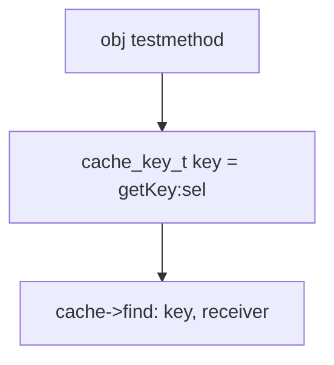

# 消息传递


## 缓存查找

给定 目标 `SEL`,获取目标对应的 `bucket_t` 中的`IMP`




缓存调用栈


一、 `[obj testmethod]` 调用
二、 获取方法选择器对应的KEY

```
cache_key_t getKey(SEL sel) 
{
    assert(sel);
    return (cache_key_t)sel;
}
```
三、获取`bucket_t` 中`SEL`对应的key
```
static void cache_fill_nolock(Class cls, SEL sel, IMP imp, id receiver)
{
    ///略。。。
    cache_key_t key = getKey(sel);

    ///略。。。
    bucket_t *bucket = cache->find(key, receiver);
    if (bucket->key() == 0) cache->incrementOccupied();
    bucket->set(key, imp);
}
```
** `cache->find(key, receiver);`**
```
bucket_t * cache_t::find(cache_key_t k, id receiver)
{
    assert(k != 0);
    bucket_t *b = buckets();
    mask_t m = mask();
    mask_t begin = cache_hash(k, m);
    mask_t i = begin;
    do {
        if (b[i].key() == 0  ||  b[i].key() == k) {
            return &b[i];
        }
    } while ((i = cache_next(i, m)) != begin);

    // hack
    Class cls = (Class)((uintptr_t)this - offsetof(objc_class, cache));
    cache_t::bad_cache(receiver, (SEL)k, cls);
}
```
bucket_t 对应的KEY 实际是经过HASH 算法得到

四、通过 `bucket_t` 获取`IMP` 调用方法

## 当前类中查找
- 对于 **已排序好**列表，采用 **二分查找**算法查找方法
- 对弈 **没有排序**列表，采用 **一般遍历**查找对应方法

## 父类逐级查找


